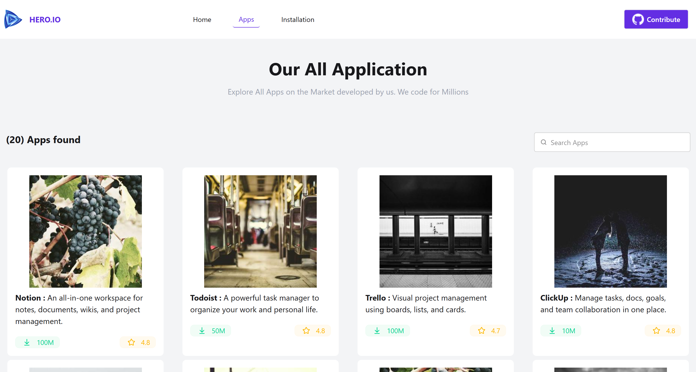
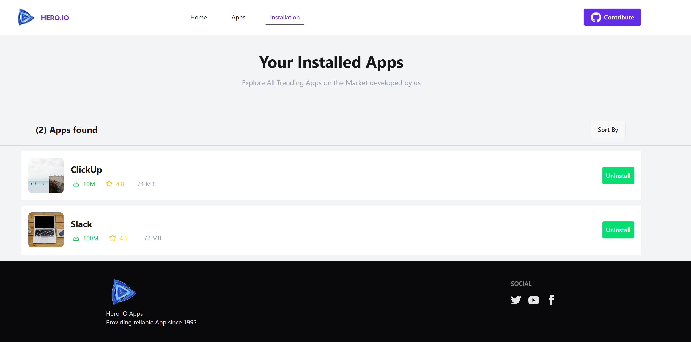

# 🚀 Hero IO – Productivity Apps Directory

Hero IO is a modern and responsive web application built with React that helps users discover popular productivity applications in a clean and organized interface.

## 🌐 Live Demo

🔗 https://hero-io-apps-3h7.pages.dev/

## ✨ Features

* Responsive design for Mobile, Tablet, and Desktop
* Beautiful and modern user interface
* Dynamic app listing using JSON data
* App cards with logo, category, and information
* Clean navigation and user-friendly layout
* Fast performance with Vite

## 🛠️ Technologies Used

* React.js
* React Router
* JavaScript (ES6+)
* Tailwind CSS
* DaisyUI
* Vite

## 📂 Installation

```bash
git clone <repository-url>
cd hero-io
npm install
npm run dev
```

## 📸 Screenshots







## 🎯 Future Improvements

* Search functionality
* Filter by category
* Favorites feature
* Dark Mode
* User authentication

## 👨‍💻 Author

**MD Fahim Pathan**

LinkedIn:
https://www.linkedin.com/in/mdfahimpathan61/

Thank you for visiting this project. Feedback and suggestions are always welcome!
